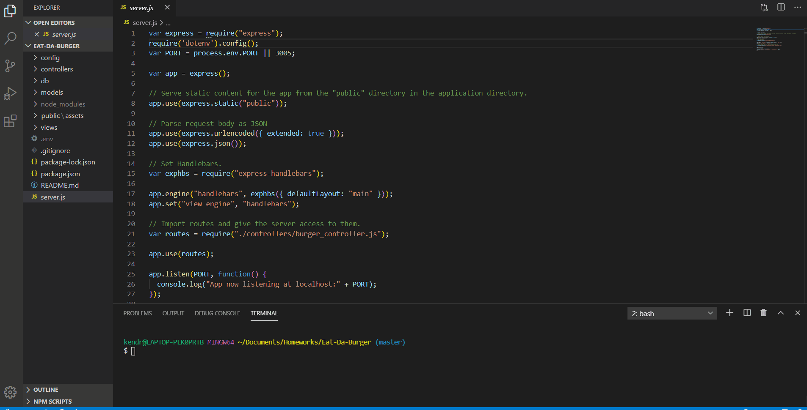

  # Eat-Da-Burger!
  ```
  Github Link: https://github.com/kkwoka/Eat-Da-Burger

  Heroku Link: https://rocky-ocean-88521.herokuapp.com/
  ```

  ## Description
  ​
    Use get, post, and put requests to show all burgers in a mySQL table, add burgers to the same table, and update burgers in that table.
  ​
  ## Table of Contents 
  * [Installation](#installation)
  ​
  * [GIFs](#GIFs)
  ​  ​  ​
  * [Tests](#tests)
  ​
  * [Questions](#questions)
  ​
  ## Installation
  ​
  To install necessary dependencies, run the following command:
  ```
  npm i
  ```
  ## GIFs
  ​
  
  ​  ​
  ​
  ## Tests
  ​
  To run the code, run the following command:
  ```
  node server.js
  ```
 
  ## Questions
  ​
  
  ​
  If you have any questions about the repo, contact [kkwoka](https://github.com/kkwoka).